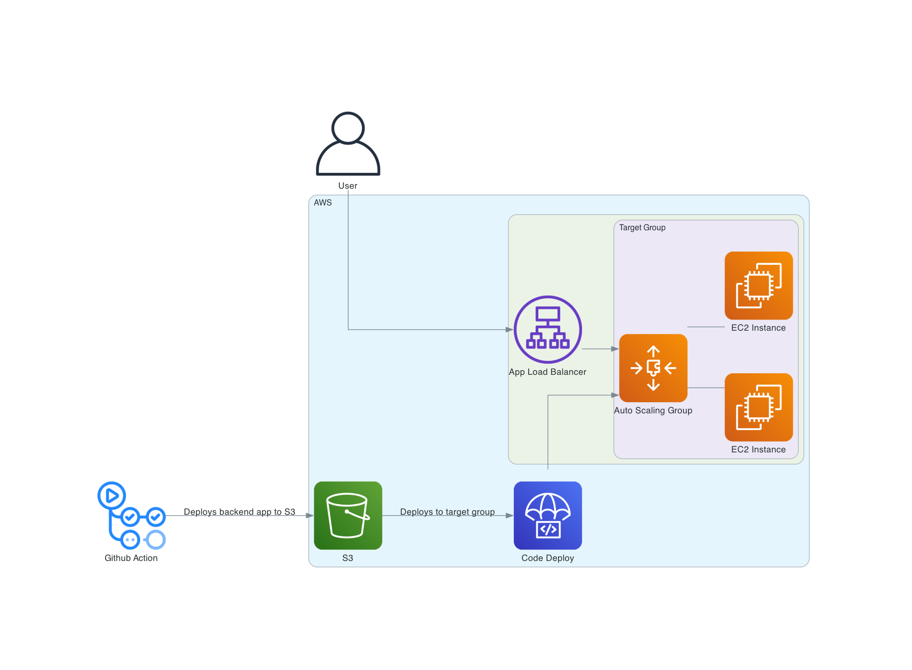
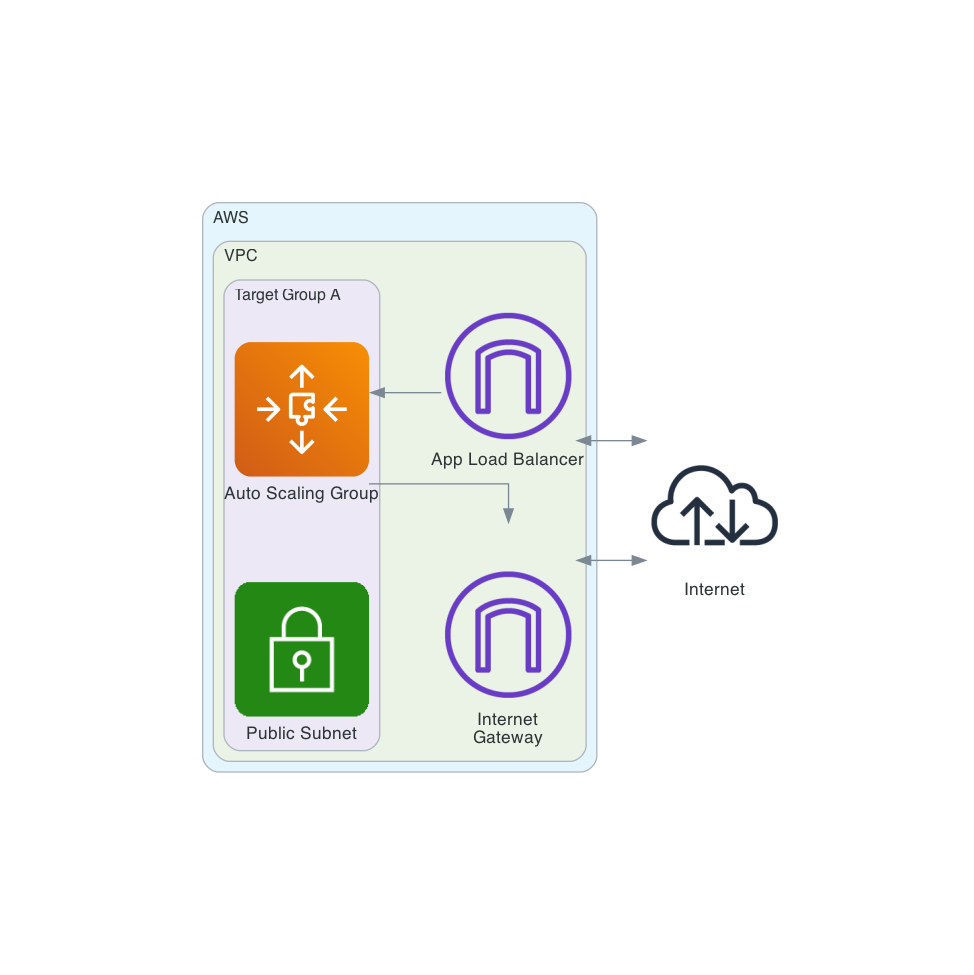

# aws-loadbalancer-demo

Demo Project to explore setting up an EC2 workflow with Auto Scaling, Application Load Balancing and Code Deploy for deployments.

Uses a Simple Express App for testing

## Architecture Diagram

VPC setup

