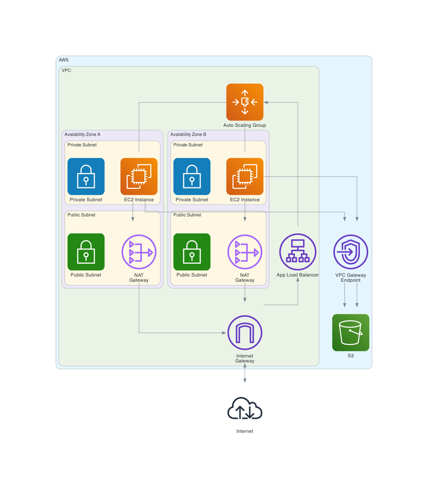

# Infastructure

## Overview

- CloudFormation: Used to deploy infastructure on AWS.
- GitHub action: deploy.yml runs on change to app folder. Builds + tests app and creates CodeDeploy deployment from S3.

Note: App Load Balancer and NAT Gateways have promisioned hourly costs even when idle

## Architecture Diagram


VPC



### Create key pair

```
aws ec2 create-key-pair \
    --key-name ec2test \
    --key-type rsa \
    --key-format pem \
    --query "KeyMaterial" \
    --output text > keyname.pem
```
