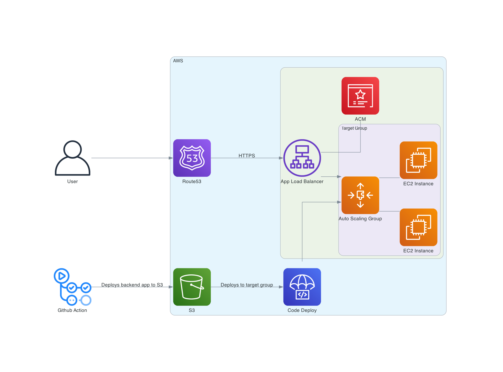

# Infastructure

## Overview

- ALB
- ASG -> EC2 launch template

- CloudFormation: Used to deploy infastructure on AWS.
- Code Deploy used to deploy app code

Note: App Load Balancer and NAT Gateway have a public ipv4 address attached so will have a cost for been provisined

## Architecture Diagram




### Create key pair

```
aws ec2 create-key-pair \
    --key-name ec2test \
    --key-type rsa \
    --key-format pem \
    --query "KeyMaterial" \
    --output text > keyname.pem
```
